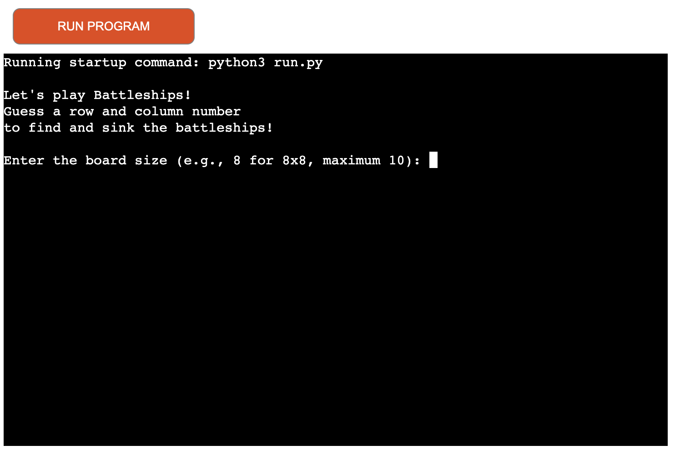

# Battleships

The Battleships game is designed to provide an engaging and interactive experience for the user. Each function contributes to a specific aspect of the game, ensuring it is intuitive, challenging, and enjoyable. From creating and displaying the board to handling user input and updating the game state, every part of the program works together to deliver a cohesive and entertaining gameplay experience.
## Features and Functions

### create_board(board)
- Creates the game board as a 2D grid filled with the character '~' to represent water
- Initializes the visual representation of the game board where players will make their guesses
- Ensures a clean slate for each new game

### print_board(board)
- Prints the current state of the game board to the console
- Provides a visual display of the game board, helping players see their guesses and the status of their hits and misses
- Includes row and column numbers to guide user input

