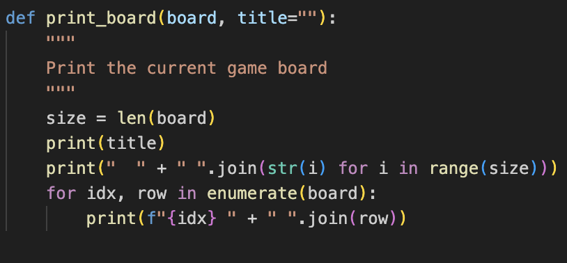
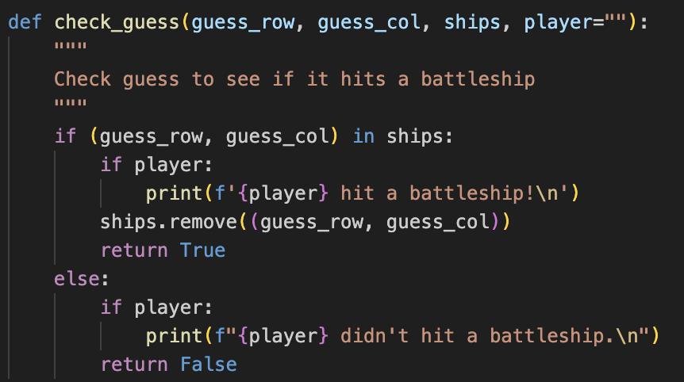
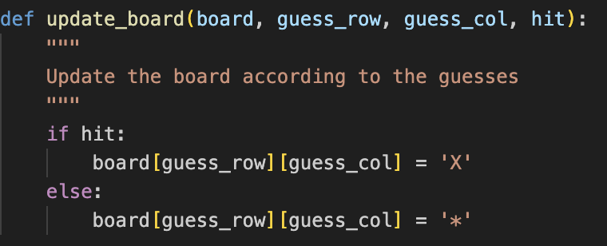
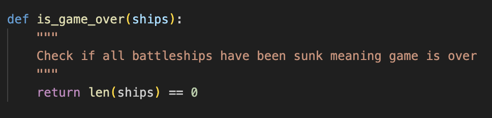
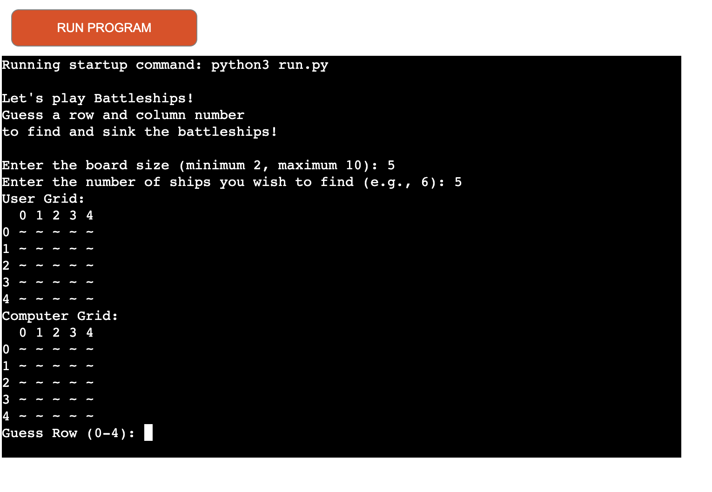

# Battleships

The Battleships game is designed to provide an engaging and interactive experience for the user. Each function contributes to a specific aspect of the game, ensuring it is intuitive, challenging, and enjoyable. From creating and displaying the board to handling user input and updating the game state, every part of the program works together to deliver a cohesive and entertaining gameplay experience.

## Features and Functions

### import random
- Imports Python's built-in random module, which provides functions to generate random numbers and perform random operations
- Enables the placement of ships at random locations on the game board, ensuring each game is unique and unpredictable, which enhances replayability and challenge

### create_board(board)

- Creates the game board as a 2D grid filled with the character '~' to represent water
- Initializes the visual representation of the game board where players will make their guesses
- Ensures a clean slate for each new game

### print_board(board)

- Prints the current state of the game board to the console
- Provides a visual display of the game board, helping players see their guesses and the status of their hits and misses
- Includes row and column numbers to guide user input

### place_ships(board, size, num_ships)

- Randomly places a specified number of ships on the game board, ensuring no two ships occupy the same space
- Adds randomness to each game, making it challenging and replayable
- Ensures that ships are distributed unpredictably, which enhances the strategic element of the game

### get_user_guess(size)

- Prompts the user to input their guess for a row and a column, validates the input, and handles incorrect input
- Ensures user input is within the valid range and prevents invalid guesses
- Provides clear feedback and re-prompts for incorrect input, enhancing the user’s interaction with the game

### check_guess(guess_row, guess_col, ships)

- Checks if the user's guess hits a ship and updates the ships list accordingly
- Provides immediate feedback on whether a guess was successful or not, keeping the user engaged
- Updates the game state based on the user's actions, creating a dynamic game environment

### update_board(board, guess_row, guess_col, hit)

- Updates the game board to mark a guessed position as hit ('X') or missed ('-')
- Visually represents the results of the user’s guesses on the game board
- Helps players keep track of their previous guesses and adjust their strategy

### is_game_over(ships)

- Checks if all ships have been sunk
- Determines the end of the game, providing confirmation when the user has successfully sunk all ships
- Signals when the game objective has been achieved, enhancing the sense of accomplishment

### get_board_size()

- Prompts the user to input the size of the game board, ensuring the size is within specified constraints
- Allows customization of the game’s difficulty and complexity
- Ensures the board size is within a manageable range, maintaining game balance and playability

### get_num_ships(size)

- Prompts the user to specify the number of ships to be placed on the board, ensuring it is within a valid range
- Offers further customization, letting players choose how challenging they want the game to be
- Validates input to maintain a reasonable game state, preventing excessive or insufficient numbers of ships

### play_game()

- Manages the overall game flow, from setting up the board and placing ships, to handling user guesses and determining the game’s end
- Provides a seamless and structured gameplay experience
- Ensures all game components work together correctly
- Offers replayability by prompting the user to play again, enhancing engagement and enjoyment

## Planning
To aid with creating the game, so that it can be recreated by someone else, I developed this flowchart that outlines the flow and decisions involved in the game.

The flowchart serves as a visual representation of the game's structure, illustrating the sequence of operations and decision points in the game. This helps developers understand the overall flow and logic of the program, making it easier to identify key components and their interactions. Additionally, the flowchart facilitates debugging and enhancement of the program by clearly mapping out each step and decision point. It acts as a guide for implementing the game, ensuring that all necessary steps are covered and properly sequenced, and enhances communication among team members by providing a clear and concise visual representation of the game's logic.

## Testing

Originally, I began testing the game throughout the development process through Gitpod's built in terminal. The program can be ran in the gitpod terminal by entering 'python3 run.py' (without apostrophes) and the program will begin.

In the terminal, I began by setting the size for the game and the amount of ships to be a fixed number within the code, however, through testing, I found it would create a more positive user experience to allow the user to input these figures themselves, so that they can determine how challenging they want the game to be.

The user is limited in their guesses to provide a greater challenge. If this was not implemented, the user would be able to guess infinitely and win the game every time. The amount of guesses is equal to three times the size of the board. For example, if the user wants a board size of 8 rows by 8 columns, they are given 8 * 3 = 24 guesses. This enables the user a proportionate amount of guesses while still posing the risk of running out of guesses before they have found every battleship.

As the command line / terminal is somewhat basic and primitive in visual representation of the game, I felt it was necessary to include numbered markers for each row and column, which makes guessing grid numbers far easier for the user.

When moving over to the deployment of the game, the terminal is actually limited to 80 columns by 24 lines, which means that each line of text needs to be 80 characters or less or else it will be wrapped onto a second line. This presents an issue when allowing the user to input their desired size of the grid, as having information wrap to a new line disrupts how the grid is presented, making deciding on which cell to choose difficult as they fall out of alignment with the grid numbers that represent the column and row. Because of this constraint, I needed to set a limit of 10x10 grid size so the user experience isn't affected.

## Deployment

The program was deployed using Heroku. Heroku is a cloud platform that could be used to deploy and run this Battleship game program, allowing users to access and play it online through a web interface.

The steps used to deploy this program on Heroku are as follows:

1. Login to Heroku or create an account
2. Click 'New' and select 'Create New App'
3. Create a name for the Heroku app and select your region
4. Select 'Github' as the deployment method (You may be asked to sign into Github)
5. Connect the repository your program resides in
6. Enable Automatic Deploys or deploy manually from the 'main' branch
7. Move to the 'Settings' tab
8. Create a Config Var with a key of PORT and a value of 8000
9. Scroll down to Buildpacks, and first add the Python buildpack, and then add another Buildpack, nodejs
10. Move back to the deployment section, and click 'Deploy Branch'. Heroku will now create the app and provide a link to the deployed program with a deployment terminal with which the game can be interacted with.

